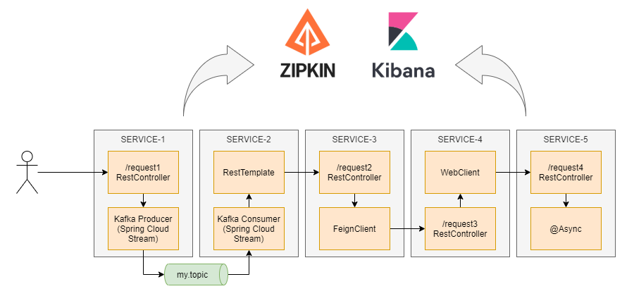

# Spring Cloud Sleuth in action

[Spring Cloud Sleuth](https://docs.spring.io/spring-cloud-sleuth/docs/current/reference/html/index.html) is the solution for [distributed tracing](https://opentracing.io/docs/overview/what-is-tracing/) provided by **Spring** and comes with a bunch of useful [integrations](https://docs.spring.io/spring-cloud-sleuth/docs/current/reference/html/integrations.html#sleuth-integration) out of the box

I've created this [spring-cloud-sleuth-in-action](https://github.com/rogervinas/spring-cloud-sleuth-in-action) sample to use some of these integrations executing the following flow:



To keep it simple everything will be executed within the same **Spring Boot Application** but at the end it is the same as if it was splitted between different services

## Demo time!

Let's follow these steps to execute the demo:

* Start the **Spring Boot Application**:

    ```bash
    SPRING_PROFILES_ACTIVE=docker-compose ./gradlew bootRun
    ```

* Consume from the **Kafka** topic `my.topic` with [kcat](https://github.com/edenhill/kcat):

    ```bash
    kcat -b localhost:9094 -C -t my.topic -f '%h %s\n'
    ```

* Execute a request to the first endpoint with [curl](https://curl.se/) or any other tool you like:

    The default format for [context propagation](https://docs.spring.io/spring-cloud-sleuth/docs/current/reference/html/project-features.html#features-context-propagation) is [B3](https://github.com/openzipkin/b3-propagation) so we use headers `X-B3-TraceId` and `X-B3-SpanId`
    ```bash
    curl http://localhost:8080/request1?payload=hello \
      -H 'X-B3-TraceId: aaaaaa1234567890' \
      -H 'X-B3-SpanId: bbbbbb1234567890'
    ```

* Check application output:

    All lines should share the same `traceId`

    ```
    Started MyApplicationKt in 44.739 seconds (JVM running for 49.324) - traceId ? spanId ? - main
    >>> RestRequest1 hello  - traceId aaaaaa1234567890 spanId cf596e6281432fb9 - http-nio-8080-exec-7
    >>> KafkaProducer hello - traceId aaaaaa1234567890 spanId cf596e6281432fb9 - http-nio-8080-exec-7
    >>> KafkaConsumer hello - traceId aaaaaa1234567890 spanId 91e1b6b37334620c - KafkaConsumerDestination...
    >>> RestRequest2 hello  - traceId aaaaaa1234567890 spanId a1ac0233664f5249 - http-nio-8080-exec-8
    >>> RestRequest3 hello  - traceId aaaaaa1234567890 spanId bf384c3b4d97efe9 - http-nio-8080-exec-9
    >>> RestRequest4 hello  - traceId aaaaaa1234567890 spanId c84470ce03e993f1 - http-nio-8080-exec-1
    >>> AsyncService hello  - traceId aaaaaa1234567890 spanId acccead477b4e1c8 - task-3
    ```

* Check [kcat](https://github.com/edenhill/kcat) output:

    ```
    b3=aaaaaa1234567890-331986280d41ccdc-1,
    nativeHeaders={"b3":["aaaaaa1234567890-331986280d41ccdc-1"]},
    contentType=application/json,
    spring_json_header_types={
        "b3":"java.lang.String",
        "nativeHeaders":"org.springframework.util.LinkedMultiValueMap",
        "contentType":"java.lang.String"
    }
    hello
    ```

* Check [zipkin](https://zipkin.io/) at [http://localhost:9411/zipkin/](http://localhost:9411/zipkin/)


## Show me the code!

This demo was created using this [spring initializr configuration](https://start.spring.io/#!type=gradle-project&language=kotlin&platformVersion=2.4.2.RELEASE&packaging=jar&jvmVersion=11&groupId=com.example&artifactId=demo&name=demo&description=Demo%20project%20for%20Spring%20Boot&packageName=com.example.demo&dependencies=web,cloud-starter-sleuth,webflux,cloud-starter-zipkin,cloud-stream)

Just adding the **sleuth** dependency will enable tracing by default in any of the supported [integrations](https://docs.spring.io/spring-cloud-sleuth/docs/current/reference/html/integrations.html#sleuth-integration), so as you will see no extra coding is needed (maybe only a few exceptions) 

### Logging

We need to add **traceId** and **spanId** values to the application log. In production we would use the [logstash-logback-encoder](https://github.com/logstash/logstash-logback-encoder) to generate logs in JSON format and send them to an [ELK](https://www.elastic.co/what-is/elk-stack) but for the demo we use this plain text [logback layout](http://logback.qos.ch/manual/layouts.html):

```xml
<configuration>
    <appender name="STDOUT" class="ch.qos.logback.core.ConsoleAppender">
        <encoder>
            <pattern>%msg - traceId %X{traceId:-?} spanId %X{spanId:-?} - %thread%n</pattern>
        </encoder>
    </appender>
    <root level="ERROR">
        <appender-ref ref="STDOUT" />
    </root>
</configuration>
```

### RestController

Create your @RestController as usual

```kotlin
@RestController
class MyRestController {

  companion object {
    private val LOGGER = LoggerFactory.getLogger(MyRestController::class.java)
  }

  @GetMapping("/request1")
  fun request1(@RequestParam("payload") payload: String): String {
    LOGGER.info(">>> RestRequest1 $payload")
    // do more stuff
    return "ok"
  }
}
```

### Kafka Producer & Consumer

We have a few alternatives to propagate tracing information when publishing to **kafka**

For example, we can use [Spring for Apache Kafka](https://docs.spring.io/spring-kafka/docs/current/reference/html) and create a **KafkaProducer** or **KafkaConsumer** using the autoconfigured **KafkaProducerFactory** or **KafkaConsumerFactory**. We can use the autoconfigured **KafkaTemplate** too

In this demo we use [Spring Cloud Stream](https://docs.spring.io/spring-cloud-stream/docs/3.1.0/reference/html/) and [Reactive Functions Support](https://docs.spring.io/spring-cloud-stream/docs/3.1.0/reference/html/spring-cloud-stream.html#_reactive_functions_support)

* Configure binding and function definitions:

    ```yaml
    spring:
      cloud:
        stream:
          kafka:
            binder:
              brokers: "localhost:9094"
          bindings:
            consumer-in-0:
              group: ${spring.application.name}
              destination: "my.topic"
            producer-out-0:
              destination: "my.topic"
        function:
          definition: consumer;producer
    ```

* The consumer is just a @Bean implementing a lambda consuming a `<Message<PAYLOAD>>`:

    ```kotlin
    @Component("consumer")
    class MyKafkaConsumer: (Message<String>) -> Unit {
    
      companion object {
        private val LOGGER = LoggerFactory.getLogger(MyKafkaConsumer::class.java)
      }
    
      override fun invoke(message: Message<String>) {
        LOGGER.info(">>> KafkaConsumer ${message.payload}")
        // do more stuff
      }
    }
    ```

* The producer is just a @Bean implementing a lambda producing a `Flux<Message<PAYLOAD>>`:

    In this case we have to use [MessagingSleuthOperators](https://docs.spring.io/spring-cloud-sleuth/docs/current/reference/html/integrations.html#sleuth-messaging-spring-cloud-function-integration) helper methods in order to preserve the tracing context when using reactive stream functions

    ```kotlin
    @Component("producer")
    class MyKafkaProducer(private val beanFactory: BeanFactory) : () -> Flux<Message<String>> {
    
      companion object {
        private val LOGGER = LoggerFactory.getLogger(MyKafkaProducer::class.java)
      }
    
      private val sink = Sinks.many().unicast().onBackpressureBuffer<Message<String>>()
    
      fun produce(payload: String) {
        LOGGER.info(">>> KafkaProducer $payload")
        sink.emitNext(createMessageWithTracing(payload), FAIL_FAST)
      }
    
      private fun createMessageWithTracing(payload: String): Message<String> {
        return MessagingSleuthOperators.handleOutputMessage(
          beanFactory,
          MessagingSleuthOperators.forInputMessage(beanFactory, GenericMessage(payload))
        )
      }
    
      override fun invoke() = sink.asFlux()
    }
    ```

### RestTemplate

Just create a RestTemplate @Bean and inject it wherever is needed

```kotlin
@Configuration
class MyConfiguration {
  @Bean
  fun restTemplate() = RestTemplate()
}
```

### FeignClient

Just declare the @FeignClient as usual

```kotlin
@SpringBootApplication
@EnableFeignClients
class MyApplication

@FeignClient(name = "request3", url = "http://localhost:\${server.port}")
interface MyFeignClient {
  @RequestMapping(method = [RequestMethod.GET], path = ["/request3"])
  fun request3(@RequestParam("payload") payload: String) : String
}
```

### WebClient

Just create a WebClient @Bean and inject it wherever is needed

```kotlin
@Configuration
class MyConfiguration {
  @Bean
  fun webClient() = WebClient.create()
}
```

### Async

Just annotate the method with @Async as usual. Tracing context will be preserved between threads

```kotlin
@SpringBootApplication
@EnableAsync
class MyApplication

@Service
class MyAsyncService {

  companion object {
    private val LOGGER = LoggerFactory.getLogger(MyAsyncService::class.java)
  }

  @Async   
  fun execute(payload: String): CompletableFuture<String> {
    LOGGER.info(">>> AsyncService $payload")
    return CompletableFuture.completedFuture("ok")
  }
}
```

## Zipkin

In production we would send to [zipkin](https://zipkin.io/) a small percentage of all the traces (sampling) but for the demo we will send all of them:

```yaml
spring:
  sleuth:
    sampler:
      probability: 1.0
  zipkin:
    base-url: "http://localhost:9411"
```

### Docker compose

We use docker-compose with 3 containers: [kafka](https://hub.docker.com/r/wurstmeister/kafka), [zookeeper](https://hub.docker.com/r/wurstmeister/zookeeper/) and [zipkin](https://hub.docker.com/r/openzipkin/zipkin-slim)

You can either:

* Execute `docker-compose up -d` separately and then run the application executing `./gradlew bootRun`

or

* Execute `SPRING_PROFILES_ACTIVE=docker-compose ./gradlew bootRun` and the application will start docker-compose using [TestContainers Docker Compose Module](https://www.testcontainers.org/modules/docker_compose/)

### Test

One easy way to test the demo is running a SpringBootTest with an [OutputCaptureExtension](https://docs.spring.io/spring-boot/docs/current/api/org/springframework/boot/test/system/OutputCaptureExtension.html) and verify that all logs contain the expected **traceId** and **spanId** values: 

```kotlin
@SpringBootTest(webEnvironment = DEFINED_PORT)
@ExtendWith(OutputCaptureExtension::class)
@ActiveProfiles("docker-compose")
class MyApplicationShould {
  @Test
  fun `propagate tracing`(log: CapturedOutput) {
    val traceId = "edb77ece416b3196"
    val spanId = "c58ac2aa66d238b9"

    val response = request1(traceId, spanId)

    assertThat(response.statusCode).isEqualTo(OK)
    assertThat(response.body).isEqualTo("ok")

    val logLines = await()
      .atMost(TEN_SECONDS)
      .pollDelay(ONE_SECOND)
      .until({ parseLogLines(log) }, { it.size >= 7 })

    assertThatLogLineContainsMessageAndTraceId(logLines[0], "RestRequest1 hello", traceId)
    assertThatLogLineContainsMessageAndTraceId(logLines[1], "KafkaProducer hello", traceId)
    assertThatLogLineContainsMessageAndTraceId(logLines[2], "KafkaConsumer hello", traceId)
    assertThatLogLineContainsMessageAndTraceId(logLines[3], "RestRequest2 hello", traceId)
    assertThatLogLineContainsMessageAndTraceId(logLines[4], "RestRequest3 hello", traceId)
    assertThatLogLineContainsMessageAndTraceId(logLines[5], "RestRequest4 hello", traceId)
    assertThatLogLineContainsMessageAndTraceId(logLines[6], "AsyncService hello", traceId)
  }
}
```

That's it! Happy coding! 💙
